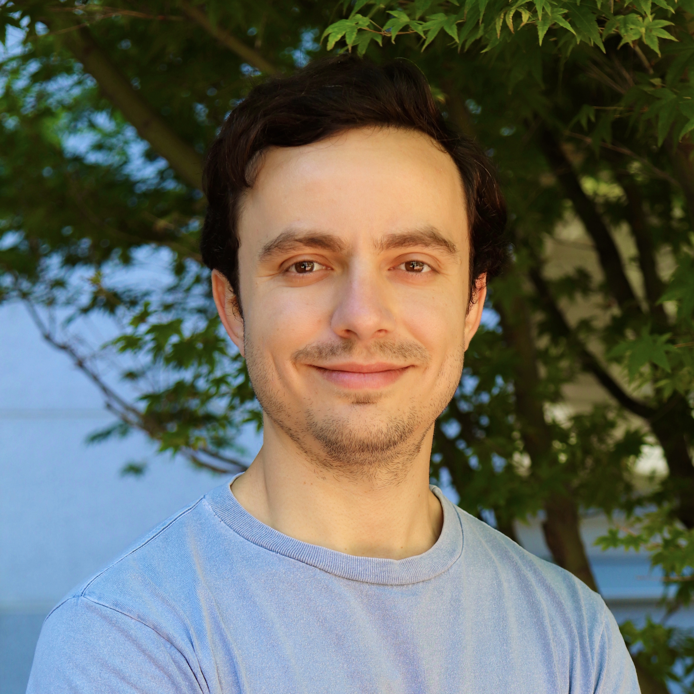

<!-- <div class="row">
  <div class="container">
    
    <p>
       <font size="+1"><b>Adam Gayoso</b></font>
       <br>
       PhD Candidate,
       <br>
       Computational Biology,
       <br>
       <a href="http://ccb.berkeley.edu">UC Berkeley</a>,
       <br>
       adamgayoso [at] berkeley [dot] edu,
       <br>
      <a href="https://twitter.com/adamgayoso" class="icon">
        <i class="fa fa-twitter fa-lg"></i>
      </a>
      <a href="https://github.com/adamgayoso" class="icon">
          <i class="fa fa-github fa-lg"></i>
      </a>
      <a href="https://linkedin.com/in/adam-gayoso" class="icon">
          <i class="fa fa-linkedin fa-lg"></i>
      </a>
    </p>
    <div style="clear: both"></div>
  </div>
  <hr>
</div> -->

<br>
<br>
<br>
<br>

::::{grid} 1 2 3 4
:padding: 0
:gutter: 1


:::{grid-item-card}
:columns: auto
:padding: 0
:margin: 0

```{image} ./_assets/adam_square.jpeg
:width: 180px
:class: sd-m-auto
```
**Adam Gayoso**
<br>
PhD Candidate,
<br>
Computational Biology,
<br>
[UC Berkeley](http://ccb.berkeley.edu),
<br>
adamgayoso [at] berkeley [dot] edu
:::

::::

<h2>About</h2>

I am a PhD candidate in the Center for Computational Biology at UC Berkeley co-advised by [Aaron Streets](http://streetslab.berkeley.edu) and [Nir Yosef](https://yoseflab.github.io/).
I develop deep probabilistic models for single-cell omics data that learn an expressive representation of the data and facilitate common analysis tasks.
In my research, I use these models to refine our understanding of immune cells.
I am also the co-creator of single-cell variational inference tools ([scvi-tools](http://scvi-tools.org/)), which is a Python package that provides accessible implementations of state-of-the-art single-cell probabilistic models as well as the building blocks to rapidly develop new models.

I received my BS in Operations Research: Engineering Management Systems and MS in Computer Science from
Columbia University. At Columbia, I developed computational models for single-cell
RNA-sequencing data with the [Dana Pe'er Lab](https://www.mskcc.org/research-areas/labs/dana-pe-er) including a [method](https://github.com/JonathanShor/DoubletDetection) to detect doublets in single-cell RNA-sequencing datasets.

----


```{toctree}
:hidden: true
:maxdepth: 1
:titlesonly: true

publications
blog
CV <./_assets/CV_Adam_Gayoso.pdf#http://>
```